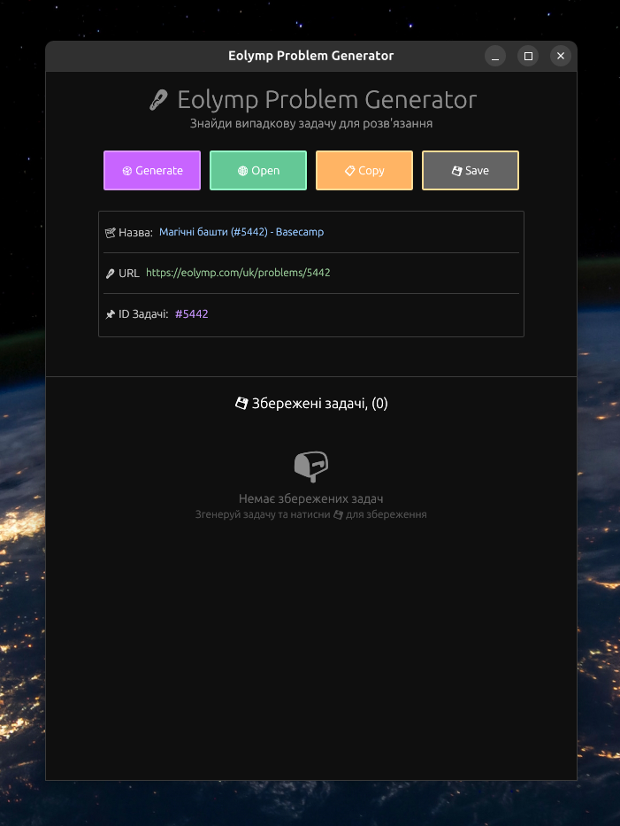

<div align="center">

# eolymp

[](LICENSE)
[](https://www.rust-lang.org/)

> Швидко знайдіть цікаву задачу на Eolymp

</div>

## ✨ Можливості

- 🎯 **Генерування випадкових задач** - Отримуйте випадкові задачі з Eolymp натиском однієї кнопки
- 🌐 **Швидкий доступ** - Відкривайте завдання прямо в браузері без зайвих кліків
- 📋 **Копіювання URL** - Легко копіюйте посилання на задачу в буфер обміну
- 💾 **Збереження улюблених** - Зберігайте цікаві задачі у локальній базі даних для подальшого розв'язання
- 🎨 **Красивий інтерфейс** - Темний режим з яскравими акцентами для комфортної роботи

## 🖼️ Інтерфейс

<div align="center">
    
    <p><i>Демонстрація інтерфейсу застосунку</i></p>
</div>

## 📦 Залежності

- **[eframe](https://crates.io/crates/eframe/)** - Framework для побудови графічного інтерфейсу.
- **[egui](https://crates.io/crates/egui/)** - Immediate mode GUI toolkit.
- **[diesel](https://crates.io/crates/diesel/)** - ORM для роботи з базою даних.
- **[reqwest](https://crates.io/crates/reqwest/)** - HTTP клієнт для веб-запитів.
- **[scraper](https://crates.io/crates/scraper/)** - Парсер HTML.
- **[rand](https://crates.io/crates/rand/)** - Генератор випадкових чисел.
- **[open](https://crates.io/crates/open/)** - Відкриття посилань у браузері за замовчуванням.


## 🚀 Швидкий старт

### Вимоги

- Rust 1.70+
- SQLite3

### Встановлення

```bash
# Клонуємо репозиторій

git clone https://github.com/noinsts/eolymp.git
cd eolymp

# Збираємо проєкт
cargo build --release

# Запускаємо додаток
cargo run --release
```

## 🎮 Використання

### Основні функції

| Кнопка          | Опис                                                       |
|-----------------|------------------------------------------------------------|
| 🎲 **Generate** | Генерує випадкову задачу з бази Eolymp (ID від 1 до 12000) |
| 🌐 **Open**     | Відкриває згенеровану задачу у вашому браузері             |
| 📋 **Copy**     | Копією URL задачі у буфер обміну                           |
| 💾 **Save**     | Зберігає задачу у списку улюблених                         |

### Збережені задачі

У нижній частині вікна відображають всі збережені задачі з можливістю:

- 🌐 Відкрити у браузері
- 📋 Копіювати посилання
- 🗑️ Видалити з колекції

## 💾 База даних

Додаток автоматично генерує локальну базу даних `eolymp.db` з наступною структурою

```sql
CREATE TABLE IF NOT EXISTS problems (
    id INTEGER PRIMARY KEY AUTOINCREMENT,
    problem_id INTEGER NOT NULL UNIQUE,
    name TEXT NOT NULL,
    url TEXT NOT NULL
)
```

## 📝 Ліцензія

Цей проєкт розповсюджується під ліцензією [MIT](https://opensource.org/license/mit). Див. файл [LICENSE](./LICENSE) для деталей.

## ✨ Автор

<div align="center">
  <table>
    <tr>
      <td align="center">
        <a href="https://github.com/noinsts">
          
          <br />
          <sub><b>noinsts</b></sub>
        </a>
        <br />
        <a href="https://github.com/noinsts/weather-rs/commits?author=noinsts" title="Code">💻</a>
        <a href="#maintenance-noinsts" title="Maintenance">🚧</a>
      </td>
    </tr>
  </table>
</div>

## 📧 Контакти

Якщо у вас є питання або пропозиції, відкрийте Issue або зв'яжіться зі мною через GitHub.

---

<div align="center">

<p><b>Щасливого розв'язання задач</b></p>
<p>Зроблено з ❤️ для спільноти програмістів</p>

</div>
